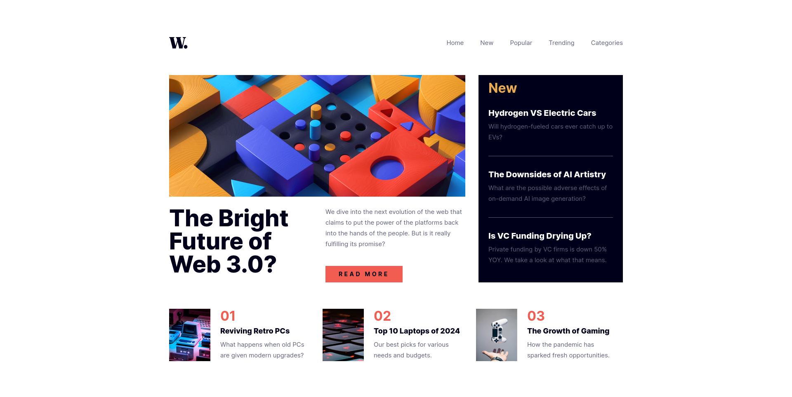

# Frontend Mentor - News homepage solution

This is a solution to
the [News homepage challenge on Frontend Mentor](https://www.frontendmentor.io/challenges/news-homepage-H6SWTa1MFl).
Frontend Mentor challenges help you improve your coding skills by building realistic projects.

## Table of contents

- [Overview](#overview)
    - [The challenge](#the-challenge)
    - [Screenshot](#screenshot)
    - [Links](#links)
- [My process](#my-process)
    - [Built with](#built-with)
    - [What I learned](#what-i-learned)
    - [Continued development](#continued-development)
    - [Useful resources](#useful-resources)
    - [AI Collaboration](#ai-collaboration)
- [Author](#author)
- [Acknowledgments](#acknowledgments)

## Overview

### The challenge

Users should be able to:

- View the optimal layout for the interface depending on their device's screen size (mobile, tablet, and desktop)
- See hover and focus states for all interactive elements on the page
- Navigate the mobile menu with proper accessibility support
- Experience smooth animations when opening/closing the mobile navigation

### Screenshot



### Links

- Solution URL: [https://github.com/runny-life/news-homepage](https://github.com/runny-life/news-homepage)
- Live Site URL: [https://runny-life.github.io/news-homepage/](https://runny-life.github.io/news-homepage/)

## My process

### Built with

- Semantic HTML5 markup with proper ARIA attributes
- CSS custom properties (variables) for maintainable theming
- Flexbox and CSS Grid for layout
- Mobile-first workflow
- BEM-like naming convention for CSS classes
- Vanilla JavaScript for enhanced interactivity
- @font-face for custom font loading
- Picture element for responsive images
- CSS animations and transitions for smooth UX

### What I learned

Working on this project reinforced several important web development concepts:

#### Accessibility First Development:

```html

<button
  class="menu-toggle"
  type="button"
  aria-label="Toggle navigation menu"
  aria-expanded="false"
  aria-controls="primary-menu"
  data-js-menu-toggle
>
```

Implementing proper ARIA attributes ensures the navigation is accessible to screen reader users.

#### Custom CSS Properties for Consistent Design:

```css
:root {
  --text-preset-1: var(--fw-extra-bold) 3.5rem/3.5rem var(--ff-base);
  --text-preset-2: var(--fw-extra-bold) 2.5rem/2.5rem var(--ff-base);
  /* ... */
}
```

Creating design tokens as CSS variables made maintaining consistent typography and spacing across the project much
easier.

#### Mobile Menu Toggle with Smooth Animation:

```js
document.addEventListener("DOMContentLoaded", () => {
  const buttonMenuToggle = document.querySelector("[data-js-menu-toggle]");

  buttonMenuToggle.addEventListener("click", () => {
    const isOpen = document.body.classList.toggle("is-open");
    buttonMenuToggle.setAttribute("aria-expanded", isOpen);
    buttonMenuToggle.querySelector("img").src = isOpen ?
      "./assets/images/icon-menu-close.svg" :
      "./assets/images/icon-menu.svg";
  });
});
```

This JavaScript handles the mobile menu toggle, updates ARIA attributes, and swaps the menu icon to provide clear visual
feedback.

### Continued development

In future projects, I want to focus on:

- Advanced CSS Grid layouts - While I used grid for the hero section, I want to explore more complex grid patterns
- Performance optimization - Implementing lazy loading strategies for off-screen images and optimizing assets
- JAMstack approach - Converting this static page into a dynamic site using a headless CMS
- Testing - Adding unit tests for JavaScript functionality and accessibility testing tools
- CSS-in-JS - Exploring styled-components or other CSS-in-JS solutions for component-based architecture

### Useful resources

MDN Web Docs - ARIA - Essential reference for implementing accessible web components

CSS Tricks - A Complete Guide to Grid - Helped me understand and implement the grid layout for the hero section

Frontend Mentor Community - Valuable feedback and inspiration from other developers

W3Schools - CSS @font-face Rule - Guide for implementing custom fonts with fallbacks

Google Fonts - Inter - Font selection and optimization tips

### AI Collaboration

## Author

- Website - [GitHub](https://github.com/runny-life)
- Frontend Mentor - [@runny-life](https://www.frontendmentor.io/profile/runny-life)

## Acknowledgments

I'd like to thank the Frontend Mentor community for providing such comprehensive challenges that help developers grow
their skills. Special thanks to everyone who shares their solutions and provides constructive feedback.
